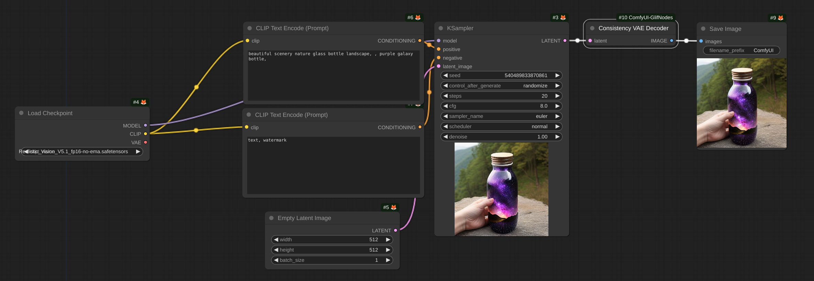
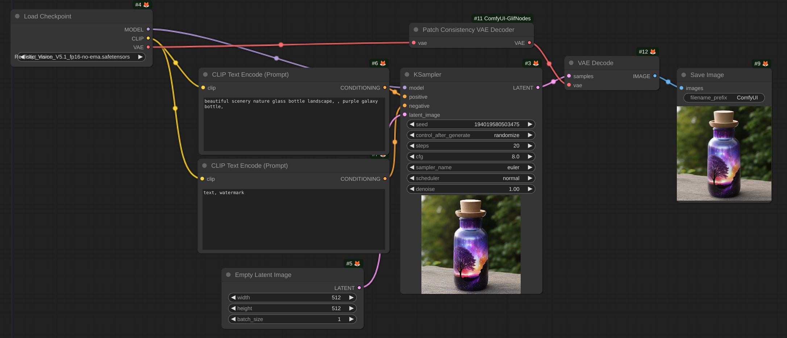
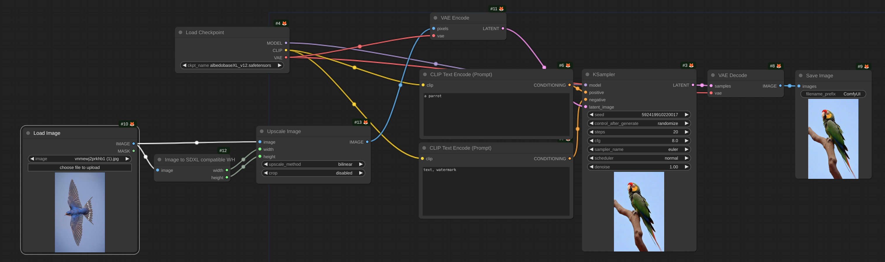
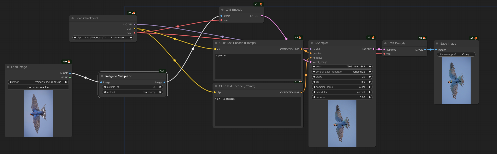

# ComfyUI-GlifNodes

Custom nodes for comfyUI.

# Install

```
pip install -r requirements.txt
```

# Nodes

<details>
  <summary><b><code>GlifConsistencyDecoder</code></b> openai's consistency decoder from hf hub</summary>
    
</details>
<details>
  <summary><b><code>🧪GlifPatchConsistencyDecoderTiled</code></b> decoder supporting tiled decoding</summary>
    
</details>
<details>
  <summary><b><code>SDXLAspectRatio</code></b> find the closest SDXL height and width for an image</summary>
    
</details>
<details>
  <summary><b><code>ImageToMultipleOf</code></b> either crop or stretch an image to a multiple of a specific value</summary>
    
</details>

<br>

# Acknowledgements

diffusers: https://github.com/huggingface/diffusers
openai - consistencydecoder: https://github.com/openai/consistencydecoder
